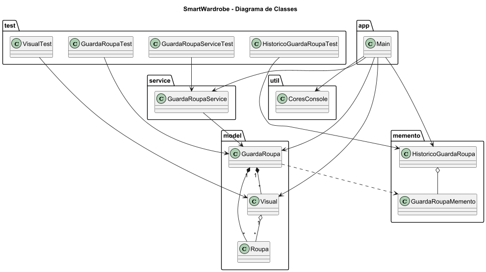

# SmartWardrobe

Sistema inteligente de gerenciamento de guarda-roupa desenvolvido em Java utilizando o padrão de projeto Memento.

O projeto permite cadastrar roupas, criar combinações de visuais, salvar estados do guarda-roupa e restaurar snapshots anteriores, simulando um sistema de recuperação de estados semelhante ao funcionamento de aplicações modernas.

---

# Padrão de Projeto Utilizado

## Memento

O padrão comportamental Memento foi utilizado para permitir o salvamento e restauração de estados anteriores do guarda-roupa sem violar o encapsulamento dos objetos.

### Estrutura do padrão no projeto

| Papel | Classe |
|---|---|
| Originator | GuardaRoupa |
| Memento | GuardaRoupaMemento |
| Caretaker | HistoricoGuardaRoupa |

---

# Diagrama de Classes



---

# Funcionalidades

- Cadastro de roupas
- Remoção de roupas
- Criação de visuais
- Exibição do guarda-roupa
- Salvamento de snapshots
- Restauração de estados anteriores
- Histórico de snapshots
- Interface interativa via console

---

# Estrutura do Projeto

```text
SmartWardrobe/
│
├── src/
│   ├── main/
│   │   ├── app/
│   │   │   └── Main.java
│   │   │
│   │   ├── model/
│   │   │   ├── Roupa.java
│   │   │   ├── Visual.java
│   │   │   └── GuardaRoupa.java
│   │   │
│   │   ├── memento/
│   │   │   ├── GuardaRoupaMemento.java
│   │   │   └── HistoricoGuardaRoupa.java
│   │   │
│   │   ├── service/
│   │   │   └── GuardaRoupaService.java
│   │   │
│   │   └── util/
│   │       └── CoresConsole.java
│   │
│   └── test/
│       ├── GuardaRoupaTest.java
│       ├── HistoricoGuardaRoupaTest.java
│       ├── VisualTest.java
│       └── GuardaRoupaServiceTest.java
│
├── docs/
│   ├── diagrama-classe.puml
│   └── diagrama-classe.png
│
├── README.md
│
└── .gitignore
```

---

# Tecnologias Utilizadas

- Java 17
- IntelliJ IDEA
- JUnit 5
- PlantUML

---

# Execução do Projeto

## Executando a aplicação

Execute a classe principal:

```text
src/main/app/Main.java
```

Ou execute pelo terminal:

```bash
javac src/main/app/Main.java
java src/main/app/Main
```

---

# Execução dos Testes

Os testes automatizados estão localizados em:

```text
src/test
```

## Executando no IntelliJ

- Clique com o botão direito na pasta `test`
- Selecione:
```text
Run Tests
```

## Executando pelo terminal

```bash
mvn test
```

---

# Casos de Teste Implementados

## GuardaRoupaTest

- Adicionar roupa
- Remover roupa
- Verificar lista vazia
- Persistência de estado

## HistoricoGuardaRoupaTest

- Salvar snapshots
- Restaurar estados
- Desfazer alterações
- Contagem de snapshots

## VisualTest

- Criar visual
- Adicionar roupas
- Verificar quantidade
- Geração textual do visual

## GuardaRoupaServiceTest

- Cadastro de roupas
- Criação de visuais
- Regras de negócio

---

# Exemplo de Funcionamento

```text
===== SMART WARDROBE =====

1 - Adicionar roupa
2 - Remover roupa
3 - Criar visual
4 - Exibir guarda-roupa
5 - Salvar estado
6 - Restaurar estado
0 - Sair
```
